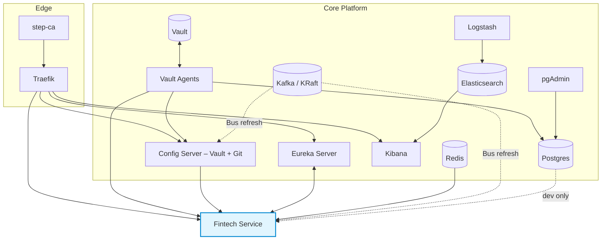

# 

# 🧭 **Danipa Fintech Platform** — Infrastructure & Operations

> Unified local platform for secure fintech development and MTN MoMo integration.  
> This README reflects the current **Docker Compose** stack: **step‑ca → Traefik TLS**, **Vault (+ Agents & Auto‑Unseal)**, **Config Server (Vault+Git composite)**, **Eureka**, **Redis**, **Kafka (KRaft)**, **Elasticsearch/Kibana/Logstash**, and **Postgres/pgAdmin**.

[](https://github.com/paboagye/danipa-fintech-platform/actions)
[](https://www.apache.org/licenses/LICENSE-2.0)


---

## Table of Contents
- [Overview](#overview)
- [Architecture](#architecture)
- [Services](#services)
- [Configuration](#configuration)
- [Running Locally](#running-locally)
- [Docker & Deployment](#docker--deployment)
- [Monitoring & Health](#monitoring--health)
- [Submodules](#submodules)
- [Contributing](#contributing)
- [License](#license)

---

<h2 id="overview">🔎 Overview</h2>

The platform wires together the core building blocks required for **secure, configurable, observable** microservices:
- **TLS** via *step‑ca* → **Traefik** issues certs with ACME against the internal CA.
- **Secrets** in **Vault**; **Vault Agents** render env files for apps (AppRole).
- **Config** through **Spring Cloud Config Server** (composite backend: **Vault + Git**).
- **Service Discovery** with **Eureka**.
- **Data/Cache/Messaging** via **Postgres**, **Redis**, **Kafka (KRaft)**.
- **Observability** via **Actuator**, **Micrometer**, **Elasticsearch + Logstash + Kibana**.

---

<h2 id="architecture">🏗️ Architecture</h2>



**Ingress hostnames (Traefik):**
- `https://config.local.danipa.com`
- `https://eureka.local.danipa.com`
- `https://fintech.local.danipa.com`
- `https://kibana.local.danipa.com`
- `https://vault.local.danipa.com`

> Traefik trusts **step‑ca**; containers trust via mounted CA / truststores.

---

<h2 id="services">🧩 Services</h2>

| Component | Purpose | Key Ports / Hostnames | Notes |
|---|---|---|---|
| **step‑ca** | Internal Certificate Authority | `:9000` | ACME endpoint for Traefik; CA cert mounted into containers. |
| **Traefik** | Ingress & TLS termination | `:443`, `:8080` | ACME against step‑ca; dashboard on `:8080` (dev). |
| **Vault** | Secrets manager | `https://vault.local.danipa.com` (`8200`) | Auto‑unseal daemon submits unseal keys. |
| **Vault Agents** | Sidecar/daemon for apps | n/a | Renders `/opt/secrets/config-client.env` & tokens. |
| **Config Server** | Externalized config (Vault+Git) | `https://config.local.danipa.com` (`8088`) | Actuator: `health, info, env, refresh, configprops, loggers`. |
| **Eureka** | Service registry | `https://eureka.local.danipa.com` (`8761`) | Self‑registered by services. |
| **Fintech Service** | MTN MoMo integrations | `https://fintech.local.danipa.com/ms` (`8080`) | Servlet context `/ms`. |
| **Redis** | Cache / token store | `6379` | Health via `redis-cli ping`. |
| **Kafka (KRaft)** | Messaging / Cloud Bus | `9092` | Plaintext in dev; auto‑create topics enabled. |
| **Elasticsearch** | Search / Observability | `9200` | Security disabled in dev; snapshots volume. |
| **Logstash** | Ingest | `4560`, `9600` | Health endpoint on `:9600/_node`. |
| **Kibana** | UI for ES | `https://kibana.local.danipa.com` (`5601`) | Health on `/api/status`. |
| **Postgres (dev)** | RDBMS | host `:${PG_PORT_DEV:-5433}` → container `5432` | Password injected by **postgres‑agent**. |
| **pgAdmin (dev)** | DB console | `https://pgadmin.local.danipa.com` (`8081`) | Optional for dev workflows. |

**Health semantics (compose‑aligned):**
- Vault: `vault status` sealed=false (auto‑unseal loops every 5s).
- Eureka / Fintech: raw TCP HTTP GETs to `.../actuator/health`.
- Config Server: curl with CA pinning to `https://127.0.0.1:8088/actuator/health`.
- Kafka: `kafka-topics.sh --list`.
- Kibana/Logstash/Elasticsearch: probe JSON status endpoints.

---

<h2 id="configuration">⚙️ Configuration</h2>

**Trust & TLS**
- Containers mount CA/truststores (e.g., `vault-root.p12`, `combined.p12`) and set JVM `-Djavax.net.ssl.trustStore` where needed.
- Traefik obtains certs from **step‑ca** via ACME; hostnames mapped using `traefik.http.routers.*` labels.

**Vault + AppRole**
- Each app has an AppRole with minimally scoped policies.
- **Agents** read `role_id` / `secret_id` and write rendered secrets/env files to `/opt/secrets` for the app to consume.

**Config Server – composite backend**
- Primary source **Vault KV** for sensitive keys (`danipa/config/...`), plus **Git** for non‑secrets.
- Actuator exposure: `health,info,env,refresh,configprops,loggers`.
- Bus refresh supported (Kafka).

**Eureka / Fintech**
- Fintech registers with Eureka and reads config from the HTTPS Config Server.
- Fintech servlet context path is `/ms` and exposes Actuator under `/ms/actuator/*`.

---

<h2 id="running-locally">🚀 Running Locally</h2>

```bash
# One-shot bring-up
docker compose up -d

# First-time CA trust (host): import ./infra/step/root_ca.crt into your browser/system trust
# Access dashboards:
open https://config.local.danipa.com
open https://eureka.local.danipa.com
open https://fintech.local.danipa.com/ms/actuator/health
open https://kibana.local.danipa.com
open https://vault.local.danipa.com
```

> Ensure `danipa-net` (external bridge) exists. The compose file maps volumes for logs, truststores, snapshots, and secrets.

---

<h2 id="docker--deployment">🐳 Docker & Deployment</h2>

- **Images**: official upstream where possible; internal apps built from local Dockerfiles.
- **Healthchecks**: compose leverages **container‑local** probes for deterministic startup ordering.
- **Restart policy**: `unless-stopped` for resiliency while iterating.
- **Volumes**: long‑lived state (e.g., `vault-data`, `es-snapshots`, `bus-kafka-data`, `pgdata_*`).
- **Secrets**: unseal key provided via `secrets:` (file-mapped).

**Targeted / Broadcast Config Refresh**
```bash
# Refresh a single instance (fintech self-refresh)
curl -fsS -X POST https://fintech.local.danipa.com/ms/actuator/refresh

# Broadcast via Spring Cloud Bus from Config Server (Kafka underlying)
curl -fsS -X POST https://config.local.danipa.com/actuator/busrefresh

# Target namespace only (all fintech instances)
curl -fsS -X POST "https://config.local.danipa.com/actuator/busrefresh?destination=danipa-fintech-service:**"
```

---

<h2 id="monitoring--health">📊 Monitoring & Health</h2>

**Actuator endpoints**
- Config Server (inside container): `https://127.0.0.1:8088/actuator/health`
- Fintech: `https://fintech.local.danipa.com/ms/actuator/health`
- Eureka: `https://eureka.local.danipa.com/actuator/health` (context path defaults)

**Logs & Metrics**
- App logs under `./logs/*` volumes.
- Optionally add Micrometer Prometheus registry; scrape to your Prometheus if needed (not included by default).

**Search & Dashboards**
- Elasticsearch: `http://elasticsearch:9200/_cluster/health`
- Kibana: `https://kibana.local.danipa.com/api/status`
- Logstash: `http://logstash:9600/_node`

---

<h2 id="submodules">🔗 Submodules</h2>

This is an umbrella with submodules for core services.

```bash
git clone --recurse-submodules https://github.com/paboagye/danipa-fintech-platform.git
git submodule update --init --recursive
```

- `danipa-config-server`
- `danipa-eureka-server`
- `danipa-fintech-service`
- `danipa-fintech-documents`

---

<h2 id="contributing">🤝 Contributing</h2>

PRs and issues are welcome. Please include logs, compose excerpts, and steps to reproduce.

---

<h2 id="license">📜 License</h2>

Apache License 2.0